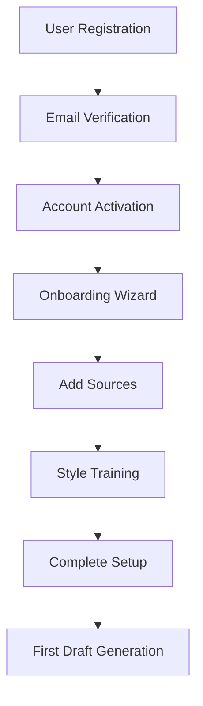
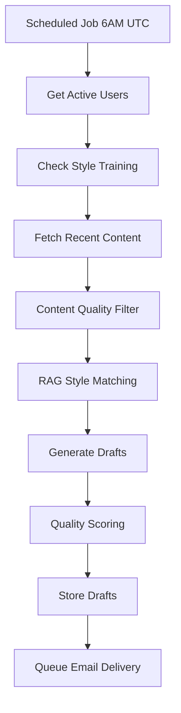
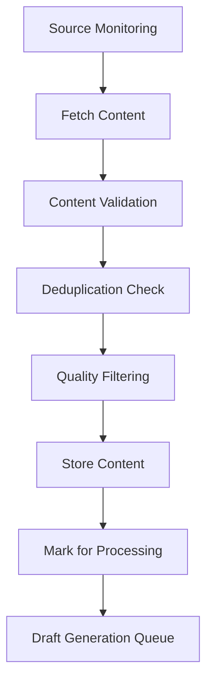

# CreatorPulse Data Models and Validation Rules

This document defines the complete data model specifications, validation rules, business logic requirements, and data flow for the CreatorPulse Core MVP backend implementation.

## Overview

The CreatorPulse data model is designed around the core workflow:
1. **User Management**: Authentication and user preferences
2. **Source Management**: Content source monitoring and health tracking
3. **Style Training**: User writing style analysis and vector storage
4. **Content Processing**: Source content fetching and deduplication
5. **Draft Generation**: AI-powered content creation with RAG
6. **Email Delivery**: Scheduled email sending with feedback tracking
7. **Feedback Collection**: User feedback processing and analytics
## 
Core Data Models

### 1. User Model

**Purpose**: Store user account information and preferences

```sql
CREATE TABLE users (
    id UUID PRIMARY KEY DEFAULT gen_random_uuid(),
    email TEXT UNIQUE NOT NULL,
    timezone TEXT DEFAULT 'UTC',
    delivery_time TIME DEFAULT '08:00:00',
    active BOOLEAN DEFAULT true,
    email_verified BOOLEAN DEFAULT false,
    created_at TIMESTAMP DEFAULT NOW(),
    updated_at TIMESTAMP DEFAULT NOW()
);
```

**Validation Rules**:
- `email`: Must be valid email format (RFC 5322), unique across system
- `timezone`: Must be valid IANA timezone identifier (e.g., "America/New_York")
- `delivery_time`: Must be in HH:MM:SS format (24-hour), between 06:00:00 and 22:00:00
- `active`: Defaults to true, can be set to false to disable account

**Business Logic**:
- Email verification required before full account activation
- Timezone affects email delivery scheduling
- Inactive users don't receive emails or generate drafts
- User deletion cascades to all related data

**Indexes**:
```sql
CREATE UNIQUE INDEX idx_users_email ON users(email);
CREATE INDEX idx_users_active ON users(active) WHERE active = true;
```### 
2. Source Model

**Purpose**: Store and manage content sources (RSS feeds, Twitter handles)

```sql
CREATE TABLE sources (
    id UUID PRIMARY KEY DEFAULT gen_random_uuid(),
    user_id UUID REFERENCES users(id) ON DELETE CASCADE,
    type TEXT CHECK (type IN ('rss', 'twitter')) NOT NULL,
    url TEXT NOT NULL,
    name TEXT NOT NULL,
    active BOOLEAN DEFAULT true,
    last_checked TIMESTAMP,
    error_count INTEGER DEFAULT 0,
    last_error TEXT,
    created_at TIMESTAMP DEFAULT NOW(),
    updated_at TIMESTAMP DEFAULT NOW()
);
```

**Validation Rules**:
- `type`: Must be either "rss" or "twitter"
- `url`: Must be valid URL format, accessible for RSS feeds
- `name`: 1-100 characters, required for display purposes
- `error_count`: Non-negative integer, auto-incremented on failures
- Maximum 20 sources per user

**Business Logic**:
- Sources with error_count > 5 are automatically marked inactive
- RSS feeds must return valid XML with proper content-type
- Twitter handles must exist and be accessible
- Inactive sources are not monitored for new content
- Source health is checked every 30 minutes

**Indexes**:
```sql
CREATE INDEX idx_sources_user_id_active ON sources(user_id, active);
CREATE INDEX idx_sources_last_checked ON sources(last_checked) WHERE active = true;
CREATE INDEX idx_sources_error_count ON sources(error_count) WHERE error_count > 0;
```### 3
. Style Training Models

#### 3.1 User Style Posts

**Purpose**: Store user's writing samples for style training

```sql
CREATE TABLE user_style_posts (
    id UUID PRIMARY KEY DEFAULT gen_random_uuid(),
    user_id UUID REFERENCES users(id) ON DELETE CASCADE,
    content TEXT NOT NULL,
    processed BOOLEAN DEFAULT false,
    word_count INTEGER,
    character_count INTEGER,
    created_at TIMESTAMP DEFAULT NOW(),
    processed_at TIMESTAMP
);
```

**Validation Rules**:
- `content`: 50-3000 characters, required
- `word_count`: Auto-calculated on insert/update
- `character_count`: Auto-calculated on insert/update
- Maximum 100 posts per user

**Business Logic**:
- Posts are processed asynchronously into vector embeddings
- Minimum 10 processed posts required for draft generation
- Content is cleaned and normalized before processing
- Duplicate content (by hash) is rejected

#### 3.2 Style Vectors

**Purpose**: Store vector embeddings for style matching

```sql
CREATE TABLE style_vectors (
    id UUID PRIMARY KEY DEFAULT gen_random_uuid(),
    user_id UUID REFERENCES users(id) ON DELETE CASCADE,
    style_post_id UUID REFERENCES user_style_posts(id) ON DELETE CASCADE,
    content TEXT NOT NULL,
    embedding VECTOR(768),
    created_at TIMESTAMP DEFAULT NOW()
);
```

**Validation Rules**:
- `embedding`: 768-dimensional vector from Gemini API
- `content`: Original text chunk used for embedding

**Business Logic**:
- Embeddings generated using Gemini text-embedding-004 model
- Content chunked into 500-character segments with 50-character overlap
- Used for RAG-based style matching during draft generation

**Indexes**:
```sql
CREATE INDEX idx_style_posts_user_id_processed ON user_style_posts(user_id, processed);
CREATE INDEX style_vectors_embedding_idx ON style_vectors 
USING ivfflat (embedding vector_cosine_ops) WITH (lists = 100);
CREATE INDEX idx_style_vectors_user_id ON style_vectors(user_id);
```### 4. Co
ntent Processing Models

#### 4.1 Source Content

**Purpose**: Store fetched content from user sources

```sql
CREATE TABLE source_content (
    id UUID PRIMARY KEY DEFAULT gen_random_uuid(),
    source_id UUID REFERENCES sources(id) ON DELETE CASCADE,
    title TEXT,
    content TEXT NOT NULL,
    url TEXT,
    published_at TIMESTAMP,
    processed BOOLEAN DEFAULT false,
    content_hash TEXT UNIQUE,
    created_at TIMESTAMP DEFAULT NOW()
);
```

**Validation Rules**:
- `content`: 10-10000 characters, required
- `content_hash`: SHA-256 hash for deduplication
- `url`: Original content URL (if available)

**Business Logic**:
- Content is deduplicated by hash before storage
- Only content from last 7 days is kept for processing
- Processed content older than 30 days is archived/deleted
- Content must pass quality filters (language, length, relevance)

**Indexes**:
```sql
CREATE INDEX idx_source_content_source_id_processed ON source_content(source_id, processed);
CREATE INDEX idx_source_content_published_at ON source_content(published_at DESC);
CREATE UNIQUE INDEX idx_source_content_hash ON source_content(content_hash);
```### 5
. Draft Generation Models

#### 5.1 Generated Drafts

**Purpose**: Store AI-generated LinkedIn post drafts

```sql
CREATE TABLE generated_drafts (
    id UUID PRIMARY KEY DEFAULT gen_random_uuid(),
    user_id UUID REFERENCES users(id) ON DELETE CASCADE,
    content TEXT NOT NULL,
    source_content_id UUID REFERENCES source_content(id) ON DELETE SET NULL,
    status TEXT DEFAULT 'pending' CHECK (status IN ('pending', 'approved', 'rejected')),
    feedback_token TEXT UNIQUE,
    email_sent_at TIMESTAMP,
    character_count INTEGER,
    engagement_score DECIMAL(3,1),
    generation_metadata JSONB,
    created_at TIMESTAMP DEFAULT NOW(),
    updated_at TIMESTAMP DEFAULT NOW()
);
```

**Validation Rules**:
- `content`: 50-3000 characters, LinkedIn post format
- `status`: Must be 'pending', 'approved', or 'rejected'
- `feedback_token`: Unique token for email feedback links
- `engagement_score`: Predicted score 0.0-10.0
- `character_count`: Auto-calculated on insert/update

**Business Logic**:
- 3-5 drafts generated per user per day
- Drafts expire after 30 days if no feedback
- Engagement score based on content analysis
- Generation metadata includes source attribution and AI parameters

#### 5.2 Draft Feedback

**Purpose**: Track user feedback on generated drafts

```sql
CREATE TABLE draft_feedback (
    id UUID PRIMARY KEY DEFAULT gen_random_uuid(),
    draft_id UUID REFERENCES generated_drafts(id) ON DELETE CASCADE,
    feedback_type TEXT CHECK (feedback_type IN ('positive', 'negative')) NOT NULL,
    feedback_source TEXT DEFAULT 'email' CHECK (feedback_source IN ('email', 'dashboard')),
    created_at TIMESTAMP DEFAULT NOW()
);
```

**Validation Rules**:
- `feedback_type`: Must be 'positive' or 'negative'
- `feedback_source`: 'email' (from email link) or 'dashboard' (from web UI)
- One feedback record per draft (upsert behavior)

**Business Logic**:
- Feedback updates draft status automatically
- Positive feedback improves user's engagement score
- Feedback patterns influence future draft generation
- Anonymous feedback tracking for system improvement

**Indexes**:
```sql
CREATE INDEX idx_drafts_user_id_created_at ON generated_drafts(user_id, created_at DESC);
CREATE INDEX idx_drafts_status ON generated_drafts(status);
CREATE UNIQUE INDEX idx_drafts_feedback_token ON generated_drafts(feedback_token) 
WHERE feedback_token IS NOT NULL;
CREATE INDEX idx_feedback_draft_id ON draft_feedback(draft_id);
CREATE INDEX idx_feedback_type_created_at ON draft_feedback(feedback_type, created_at);
```### 6.
 Email Delivery Models

#### 6.1 Email Delivery Log

**Purpose**: Track email delivery status and metrics

```sql
CREATE TABLE email_delivery_log (
    id UUID PRIMARY KEY DEFAULT gen_random_uuid(),
    user_id UUID REFERENCES users(id) ON DELETE CASCADE,
    email_type TEXT DEFAULT 'daily_drafts' CHECK (email_type IN ('daily_drafts', 'welcome', 'verification', 'notification')),
    sendgrid_message_id TEXT,
    status TEXT DEFAULT 'sent' CHECK (status IN ('sent', 'delivered', 'bounced', 'spam', 'failed')),
    draft_ids UUID[],
    sent_at TIMESTAMP DEFAULT NOW(),
    delivered_at TIMESTAMP,
    error_message TEXT
);
```

**Validation Rules**:
- `email_type`: Type of email sent
- `status`: Delivery status from SendGrid webhooks
- `draft_ids`: Array of draft IDs included in email
- `sendgrid_message_id`: For tracking delivery status

**Business Logic**:
- Daily drafts emails sent at user's preferred time
- Bounce/spam tracking affects future delivery
- Failed deliveries trigger retry logic
- Delivery metrics used for system monitoring

**Indexes**:
```sql
CREATE INDEX idx_email_log_user_id_sent_at ON email_delivery_log(user_id, sent_at DESC);
CREATE INDEX idx_email_log_status ON email_delivery_log(status);
CREATE INDEX idx_email_log_sendgrid_id ON email_delivery_log(sendgrid_message_id);
```## D
atabase Schema Setup

### Required Extensions

```sql
-- Enable UUID generation
CREATE EXTENSION IF NOT EXISTS "uuid-ossp";

-- Enable vector similarity search
CREATE EXTENSION IF NOT EXISTS vector;

-- Enable JSON operations
CREATE EXTENSION IF NOT EXISTS "pg_trgm";
```

### Row Level Security (RLS)

```sql
-- Enable RLS on all user tables
ALTER TABLE users ENABLE ROW LEVEL SECURITY;
ALTER TABLE sources ENABLE ROW LEVEL SECURITY;
ALTER TABLE user_style_posts ENABLE ROW LEVEL SECURITY;
ALTER TABLE style_vectors ENABLE ROW LEVEL SECURITY;
ALTER TABLE source_content ENABLE ROW LEVEL SECURITY;
ALTER TABLE generated_drafts ENABLE ROW LEVEL SECURITY;
ALTER TABLE draft_feedback ENABLE ROW LEVEL SECURITY;
ALTER TABLE email_delivery_log ENABLE ROW LEVEL SECURITY;

-- RLS policies (users can only access their own data)
CREATE POLICY users_policy ON users FOR ALL USING (auth.uid() = id);
CREATE POLICY sources_policy ON sources FOR ALL USING (auth.uid() = user_id);
CREATE POLICY style_posts_policy ON user_style_posts FOR ALL USING (auth.uid() = user_id);
CREATE POLICY style_vectors_policy ON style_vectors FOR ALL USING (auth.uid() = user_id);
CREATE POLICY drafts_policy ON generated_drafts FOR ALL USING (auth.uid() = user_id);
CREATE POLICY email_log_policy ON email_delivery_log FOR ALL USING (auth.uid() = user_id);

-- Source content accessible through user's sources
CREATE POLICY source_content_policy ON source_content FOR ALL USING (
    EXISTS (SELECT 1 FROM sources WHERE sources.id = source_content.source_id AND sources.user_id = auth.uid())
);

-- Draft feedback accessible through user's drafts
CREATE POLICY feedback_policy ON draft_feedback FOR ALL USING (
    EXISTS (SELECT 1 FROM generated_drafts WHERE generated_drafts.id = draft_feedback.draft_id AND generated_drafts.user_id = auth.uid())
);
```### Tri
ggers and Functions

```sql
-- Update updated_at timestamp automatically
CREATE OR REPLACE FUNCTION update_updated_at_column()
RETURNS TRIGGER AS $$
BEGIN
    NEW.updated_at = NOW();
    RETURN NEW;
END;
$$ language 'plpgsql';

-- Apply to relevant tables
CREATE TRIGGER update_users_updated_at BEFORE UPDATE ON users 
FOR EACH ROW EXECUTE FUNCTION update_updated_at_column();

CREATE TRIGGER update_sources_updated_at BEFORE UPDATE ON sources 
FOR EACH ROW EXECUTE FUNCTION update_updated_at_column();

CREATE TRIGGER update_drafts_updated_at BEFORE UPDATE ON generated_drafts 
FOR EACH ROW EXECUTE FUNCTION update_updated_at_column();

-- Auto-calculate character and word counts
CREATE OR REPLACE FUNCTION calculate_content_stats()
RETURNS TRIGGER AS $$
BEGIN
    NEW.character_count = LENGTH(NEW.content);
    NEW.word_count = array_length(string_to_array(trim(NEW.content), ' '), 1);
    RETURN NEW;
END;
$$ language 'plpgsql';

CREATE TRIGGER calculate_style_post_stats BEFORE INSERT OR UPDATE ON user_style_posts 
FOR EACH ROW EXECUTE FUNCTION calculate_content_stats();

CREATE TRIGGER calculate_draft_stats BEFORE INSERT OR UPDATE ON generated_drafts 
FOR EACH ROW EXECUTE FUNCTION calculate_content_stats();

-- Generate content hash for deduplication
CREATE OR REPLACE FUNCTION generate_content_hash()
RETURNS TRIGGER AS $$
BEGIN
    NEW.content_hash = encode(sha256(NEW.content::bytea), 'hex');
    RETURN NEW;
END;
$$ language 'plpgsql';

CREATE TRIGGER generate_source_content_hash BEFORE INSERT ON source_content 
FOR EACH ROW EXECUTE FUNCTION generate_content_hash();
```## 
Business Logic Requirements

### 1. User Management Logic

**Registration Flow**:
1. Validate email format and uniqueness
2. Hash password using bcrypt (cost factor 12)
3. Generate email verification token
4. Send verification email via SendGrid
5. Create user record with email_verified = false
6. User must verify email before full access

**Authentication Logic**:
1. Validate email/password combination
2. Check if user is active and email verified
3. Generate JWT token with 24-hour expiration
4. Include user ID and email in token payload
5. Track login attempts for security

### 2. Source Management Logic

**Source Addition**:
1. Validate URL format and accessibility
2. For RSS feeds: Check XML validity and content-type
3. For Twitter: Validate handle exists and is accessible
4. Enforce maximum 20 sources per user
5. Set initial status as active with error_count = 0

**Source Health Monitoring**:
1. Check each active source every 30 minutes
2. Increment error_count on failures
3. Mark inactive after 5 consecutive errors
4. Send notification to user when source fails
5. Reset error_count on successful check

### 3. Style Training Logic

**Post Processing**:
1. Validate content length (50-3000 characters)
2. Clean and normalize text (remove URLs, mentions, hashtags)
3. Check for duplicate content by hash
4. Enforce maximum 100 posts per user
5. Queue for embedding generation

**Embedding Generation**:
1. Chunk content into 500-character segments
2. Generate embeddings using Gemini API
3. Store vectors with original content reference
4. Mark post as processed when complete
5. Require minimum 10 processed posts for draft generation##
# 4. Content Processing Logic

**Content Fetching**:
1. Fetch content from active sources every 15-30 minutes
2. Parse RSS feeds and extract title, content, URL, published date
3. Fetch recent tweets (last 24 hours) from Twitter handles
4. Filter out retweets, replies, and promotional content
5. Deduplicate by content hash before storage

**Content Quality Filters**:
1. Minimum 10 characters, maximum 10,000 characters
2. Must be in English (language detection)
3. Filter out spam, promotional, or inappropriate content
4. Ensure content relevance to professional/business topics
5. Remove or flag content with excessive links or hashtags

### 5. Draft Generation Logic

**Generation Process**:
1. Run daily at 6 AM UTC for all active users
2. Check if user has sufficient style training (10+ posts)
3. Fetch unprocessed content from user's sources (last 24 hours)
4. Use RAG to find similar style examples via vector search
5. Generate 3-5 drafts using Gemini with style context
6. Apply quality filters and engagement scoring
7. Generate unique feedback tokens for each draft

**RAG Implementation**:
1. Create embedding for source content
2. Find top 5 similar style examples using cosine similarity
3. Include similar examples in generation prompt
4. Maintain user's voice, tone, and writing patterns
5. Ensure professional LinkedIn-appropriate content

### 6. Email Delivery Logic

**Scheduling**:
1. Send emails at user's preferred time in their timezone
2. Queue emails for delivery every 10 minutes
3. Include 3-5 drafts per email with feedback links
4. Handle timezone conversions accurately
5. Respect user's email preferences and unsubscribe status

**Delivery Tracking**:
1. Track SendGrid message IDs for status updates
2. Process webhooks for delivery, bounce, and spam reports
3. Automatically pause delivery for bounced/spam addresses
4. Retry failed deliveries with exponential backoff
5. Maintain 98%+ delivery success rate## 
Background Job Requirements

### Job Definitions

```python
# Content fetching jobs
@celery.task(bind=True, max_retries=3)
def fetch_rss_content(self, source_id: str):
    """Fetch and process RSS feed content"""
    try:
        # Fetch RSS feed
        # Parse and extract content
        # Store in source_content table
        # Update source last_checked
    except Exception as exc:
        # Increment error_count
        # Retry with exponential backoff
        raise self.retry(countdown=60 * (2 ** self.request.retries))

@celery.task(bind=True, max_retries=3)
def fetch_twitter_content(self, source_id: str):
    """Fetch recent tweets from Twitter handle"""
    # Similar pattern for Twitter API integration

# Style processing jobs
@celery.task(bind=True, max_retries=2)
def process_style_posts(self, user_id: str, post_ids: List[str]):
    """Generate embeddings for style training posts"""
    # Process posts in batches
    # Generate embeddings via Gemini API
    # Store in style_vectors table

# Draft generation jobs
@celery.task(bind=True, max_retries=2)
def generate_daily_drafts(self, user_id: str):
    """Generate daily drafts for user"""
    # Check user eligibility
    # Fetch recent content
    # Use RAG for style matching
    # Generate drafts via Gemini API
    # Store with feedback tokens

# Email delivery jobs
@celery.task(bind=True, max_retries=3)
def send_draft_email(self, user_id: str, draft_ids: List[str]):
    """Send draft email to user"""
    # Render email template
    # Send via SendGrid
    # Log delivery attempt
    # Handle delivery failures
```

### Job Scheduling

```python
# Celery Beat schedule configuration
CELERY_BEAT_SCHEDULE = {
    'fetch-rss-content': {
        'task': 'tasks.fetch_rss_content_all',
        'schedule': crontab(minute='*/30'),  # Every 30 minutes
    },
    'fetch-twitter-content': {
        'task': 'tasks.fetch_twitter_content_all',
        'schedule': crontab(minute='*/15'),  # Every 15 minutes
    },
    'generate-daily-drafts': {
        'task': 'tasks.generate_daily_drafts_all',
        'schedule': crontab(hour=6, minute=0),  # 6 AM UTC daily
    },
    'send-draft-emails': {
        'task': 'tasks.send_draft_emails_scheduled',
        'schedule': crontab(minute='*/10'),  # Every 10 minutes
    },
    'cleanup-old-data': {
        'task': 'tasks.cleanup_old_data',
        'schedule': crontab(hour=2, minute=0),  # 2 AM UTC daily
    },
    'update-source-health': {
        'task': 'tasks.update_source_health_all',
        'schedule': crontab(minute='*/30'),  # Every 30 minutes
    },
}
```## Exter
nal Service Integration Requirements

### 1. Gemini API Integration

**Configuration**:
```python
GEMINI_API_KEY = os.getenv("GEMINI_API_KEY")
GEMINI_MODEL_EMBEDDING = "models/text-embedding-004"
GEMINI_MODEL_GENERATION = "models/gemini-1.5-pro"
```

**Embedding Generation**:
- Model: text-embedding-004 (768 dimensions)
- Rate limit: 1500 requests per minute
- Batch size: 100 texts per request
- Retry logic: Exponential backoff for rate limits

**Content Generation**:
- Model: gemini-1.5-pro
- Rate limit: 60 requests per minute
- Context window: 1M tokens
- Temperature: 0.7 for creative but consistent output

### 2. SendGrid Integration

**Configuration**:
```python
SENDGRID_API_KEY = os.getenv("SENDGRID_API_KEY")
SENDGRID_FROM_EMAIL = "drafts@creatorpulse.com"
SENDGRID_TEMPLATE_ID = "d-1234567890abcdef"
```

**Email Templates**:
- Daily drafts template with dynamic content
- Welcome email template
- Email verification template
- Notification templates

**Webhook Handling**:
- Delivery status updates
- Bounce and spam report processing
- Unsubscribe handling
- Click tracking for feedback links

### 3. Twitter API v2 Integration

**Configuration**:
```python
TWITTER_BEARER_TOKEN = os.getenv("TWITTER_BEARER_TOKEN")
TWITTER_API_BASE = "https://api.twitter.com/2"
```

**Endpoints Used**:
- `/2/users/by/username/{username}/tweets`: Fetch recent tweets
- Rate limit: 300 requests per 15 minutes
- Fields: text, created_at, public_metrics, context_annotations

**Content Filtering**:
- Exclude retweets and replies
- Filter by engagement metrics
- Remove promotional content
- Ensure content relevance## Dat
a Flow Diagrams

### 1. User Onboarding Flow



### 2. Daily Draft Generation Flow



### 3. Content Processing Flow



### 4. Feedback Processing Flow

```mermaid
graph TD
    A[User Clicks Email Link] --> B[Validate Token]
    B --> C[Record Feedback]
    C --> D[Update Draft Status]
    D --> E[Update User Metrics]
    E --> F[Improve Future Generation]
```## Pe
rformance and Scaling Considerations

### Database Optimization

**Connection Pooling**:
```python
# SQLAlchemy configuration
DATABASE_URL = os.getenv("DATABASE_URL")
engine = create_engine(
    DATABASE_URL,
    pool_size=20,
    max_overflow=30,
    pool_pre_ping=True,
    pool_recycle=3600
)
```

**Query Optimization**:
- Use appropriate indexes for all frequent queries
- Implement query result caching for expensive operations
- Use database views for complex aggregations
- Partition large tables by date (drafts, content)

**Vector Search Optimization**:
```sql
-- Optimize vector similarity search
CREATE INDEX CONCURRENTLY style_vectors_embedding_idx ON style_vectors 
USING ivfflat (embedding vector_cosine_ops) WITH (lists = 100);

-- Function for efficient style matching
CREATE OR REPLACE FUNCTION find_similar_style_optimized(
    query_embedding VECTOR(768),
    user_id UUID,
    limit_count INTEGER DEFAULT 5,
    similarity_threshold FLOAT DEFAULT 0.7
)
RETURNS TABLE(content TEXT, similarity FLOAT)
AS $$
BEGIN
    RETURN QUERY
    SELECT 
        sv.content,
        1 - (sv.embedding <=> query_embedding) AS similarity
    FROM style_vectors sv
    WHERE sv.user_id = find_similar_style_optimized.user_id
    AND (1 - (sv.embedding <=> query_embedding)) >= similarity_threshold
    ORDER BY sv.embedding <=> query_embedding
    LIMIT limit_count;
END;
$$ language 'plpgsql';
```

### Caching Strategy

**Redis Configuration**:
```python
# Cache frequently accessed data
CACHE_CONFIG = {
    'user_sources': 3600,      # 1 hour
    'recent_drafts': 300,      # 5 minutes
    'user_settings': 1800,     # 30 minutes
    'source_health': 900,      # 15 minutes
}

# Cache implementation
@cache(expire=CACHE_CONFIG['user_sources'])
def get_user_sources(user_id: UUID):
    return db.query(Source).filter(
        Source.user_id == user_id,
        Source.active == True
    ).all()
```

### Background Job Optimization

**Job Prioritization**:
```python
# High priority: User-facing operations
CELERY_ROUTES = {
    'tasks.generate_daily_drafts': {'queue': 'high_priority'},
    'tasks.send_draft_email': {'queue': 'high_priority'},
    'tasks.process_style_posts': {'queue': 'medium_priority'},
    'tasks.fetch_content': {'queue': 'low_priority'},
    'tasks.cleanup_old_data': {'queue': 'maintenance'},
}
```

**Resource Management**:
- Separate worker pools for different job types
- Memory-aware job scheduling
- Dead letter queue for failed jobs
- Job result expiration and cleanup## Da
ta Validation and Security

### Input Validation Rules

**Email Validation**:
```python
import re
from email_validator import validate_email, EmailNotValidError

def validate_user_email(email: str) -> bool:
    try:
        # Validate email format and deliverability
        valid = validate_email(email)
        return True
    except EmailNotValidError:
        return False
```

**Content Validation**:
```python
def validate_style_post_content(content: str) -> dict:
    errors = []
    
    if len(content) < 50:
        errors.append("Content must be at least 50 characters")
    if len(content) > 3000:
        errors.append("Content must be less than 3000 characters")
    
    # Check for spam patterns
    if content.count('http') > 3:
        errors.append("Too many links in content")
    
    # Language detection
    if not is_english_content(content):
        errors.append("Content must be in English")
    
    return {"valid": len(errors) == 0, "errors": errors}
```

**URL Validation**:
```python
import validators
import requests

def validate_rss_feed(url: str) -> dict:
    if not validators.url(url):
        return {"valid": False, "error": "Invalid URL format"}
    
    try:
        response = requests.get(url, timeout=10)
        if response.status_code != 200:
            return {"valid": False, "error": "Feed not accessible"}
        
        content_type = response.headers.get('content-type', '')
        if 'xml' not in content_type.lower():
            return {"valid": False, "error": "Not a valid RSS feed"}
        
        return {"valid": True}
    except Exception as e:
        return {"valid": False, "error": str(e)}
```

### Security Measures

**Password Security**:
```python
import bcrypt

def hash_password(password: str) -> str:
    # Use bcrypt with cost factor 12
    salt = bcrypt.gensalt(rounds=12)
    return bcrypt.hashpw(password.encode('utf-8'), salt).decode('utf-8')

def verify_password(password: str, hashed: str) -> bool:
    return bcrypt.checkpw(password.encode('utf-8'), hashed.encode('utf-8'))
```

**Token Security**:
```python
import secrets
import jwt
from datetime import datetime, timedelta

def generate_feedback_token() -> str:
    return secrets.token_urlsafe(32)

def generate_jwt_token(user_id: str, email: str) -> str:
    payload = {
        'user_id': user_id,
        'email': email,
        'exp': datetime.utcnow() + timedelta(hours=24),
        'iat': datetime.utcnow()
    }
    return jwt.encode(payload, JWT_SECRET, algorithm='HS256')
```

**Data Sanitization**:
```python
import bleach
from html import escape

def sanitize_content(content: str) -> str:
    # Remove HTML tags and escape special characters
    cleaned = bleach.clean(content, tags=[], strip=True)
    return escape(cleaned)

def sanitize_url(url: str) -> str:
    # Ensure URL is safe and properly formatted
    if not url.startswith(('http://', 'https://')):
        url = 'https://' + url
    return url.strip()
```## Moni
toring and Analytics

### Key Metrics to Track

**User Metrics**:
- User registration and activation rates
- Daily/weekly/monthly active users
- User retention rates
- Onboarding completion rates

**Content Metrics**:
- Sources added per user
- Content fetching success rates
- Style training completion rates
- Draft generation success rates

**Engagement Metrics**:
- Email open and click rates
- Feedback submission rates
- Positive vs negative feedback ratios
- User satisfaction scores

**System Metrics**:
- API response times (p50, p95, p99)
- Database query performance
- Background job success rates
- External service API usage and errors

### Logging Requirements

**Structured Logging**:
```python
import structlog
import logging

# Configure structured logging
structlog.configure(
    processors=[
        structlog.stdlib.filter_by_level,
        structlog.stdlib.add_logger_name,
        structlog.stdlib.add_log_level,
        structlog.stdlib.PositionalArgumentsFormatter(),
        structlog.processors.TimeStamper(fmt="iso"),
        structlog.processors.StackInfoRenderer(),
        structlog.processors.format_exc_info,
        structlog.processors.UnicodeDecoder(),
        structlog.processors.JSONRenderer()
    ],
    context_class=dict,
    logger_factory=structlog.stdlib.LoggerFactory(),
    wrapper_class=structlog.stdlib.BoundLogger,
    cache_logger_on_first_use=True,
)

logger = structlog.get_logger()

# Usage examples
logger.info("User registered", user_id=user_id, email=email)
logger.error("Draft generation failed", user_id=user_id, error=str(e))
logger.warning("Source health check failed", source_id=source_id, error_count=error_count)
```

**Performance Monitoring**:
```python
import time
from functools import wraps

def monitor_performance(operation_name: str):
    def decorator(func):
        @wraps(func)
        def wrapper(*args, **kwargs):
            start_time = time.time()
            try:
                result = func(*args, **kwargs)
                duration = time.time() - start_time
                logger.info("Operation completed", 
                          operation=operation_name, 
                          duration=duration,
                          success=True)
                return result
            except Exception as e:
                duration = time.time() - start_time
                logger.error("Operation failed", 
                           operation=operation_name, 
                           duration=duration,
                           error=str(e),
                           success=False)
                raise
        return wrapper
    return decorator

# Usage
@monitor_performance("draft_generation")
def generate_drafts_for_user(user_id: str):
    # Draft generation logic
    pass
```

This comprehensive data model documentation provides the complete foundation for backend implementation, ensuring data integrity, security, performance, and scalability requirements are met.